# 第三章

## 算法笔记


## 上机实战指南

### 3.1 简单模拟

#### B1001

```c++
#include <cstdio>
int main()
{
	int a,i;
	scanf("%d",&a);
	for(i=0;a!=1;i++)
	{
		if(a%2) a=(3*a+1) >> 1;
		else a=a >> 1;
	}
	printf("%d",i);
	return 0;
}
```

#### B1011

```c++
#include <cstdio>
#include <algorithm>
using namespace std;
bool cmp(int a,int b,int c)
{
	long long imax=max(a,b),imin=min(a,b);//这里定义为int会有一个点不过
	return (c-imax) < imin;
}
int main()
{
	int T,a,b,c;
	scanf("%d",&T);
	for(int i=1;i<=T;i++)
	{
		scanf("%d%d%d",&a,&b,&c);
		if(cmp(a,b,c)) printf("Case #%d: true\n",i);
		else printf("Case #%d: false\n",i);
	}
	return 0;
}
```

看书上整个过程都使用`long long`来运算当然也可以，注意`long long`输入时要使用`%lld`


#### B1016

```c++
#include <cstdio>
using namespace std;
int main()
{
	int a,da,b,db,ta=0,tb=0;
	scanf("%d%d%d%d",&a,&da,&b,&db);
	while(a)
	{
		if(a%10==da) ta=ta*10+da;
		a/=10;
	}
	while(b)
	{
		if(b%10==db) tb=tb*10+db;
		b/=10;
	}
	printf("%d", ta+tb);
	return 0;
}
```

#### B1026

```c++
#include<cstdio>
int main()
{
	int t1,t2;
	scanf("%d%d",&t1,&t2);
	t1=(t2-t1+50)/100;
	int h=t1/3600,m=t1%3600/60,s=t1%60;
	printf("%02d:%02d:%02d\n",h,m,s );
	return 0;
}
```

要注意四舍五入和`%02d`，记得==总结一下输出的规范==

#### B1046

```c++
#include<cstdio>
int main()
{
	int a1,a2,b1,b2,ansa=0,ansb=0,N;
	scanf("%d",&N);
	while(N--)
	{
		scanf("%d%d%d%d",&a1,&a2,&b1,&b2);
		if(a2!=b2)
			if(a2==a1+b1)
				ansb++;
			else if(b2==a1+b1)
				ansa++;
	}
	printf("%d %d\n",ansa,ansb );
	return 0;

}
```

我这个比课本的更巧一点

#### B1008

```c++
#include<cstdio>
#define NMAX 110
int main()
{
	int m,n,num[NMAX];
	scanf("%d%d",&n,&m);
	for(int i=0;i<n;i++)
	{
		scanf("%d",& num[(i+m)%n]);
	}
	printf("%d",num[0]);
	for(int i=1;i<n;i++)
	{
		printf(" %d",num[i]);
	}
	return 0;
}
```

看看和自己之前代码的对比，感受到了动脑子编程的乐趣

```c++
//上次写这道题的时候的代码，而这也正是课本的做法
#include <cstdio>
#include <cstdlib>
#include <cstring>
#include <ctime>
#include <iostream>
#include <algorithm>
#include <stack>
#include <cmath>
#include <vector>


int main() {
    int N, M;
    int a[105];

    scanf("%d %d", &N, &M);
    M = M % N; // 这句话很重要，可以修正M>N的情况，因为序列移动N位后还是原序列，没有这句话会有两个例子不过
    for (int i = 1; i <= N; ++i) {
        scanf("%d", &a[i]);
    }

    for (int i = N - M + 1; i <= N; ++i) {
        printf("%d ", a[i]);
    }
    for (int i = 1; i < N - M; ++i) {
        printf("%d ", a[i]);
    }
    printf("%d", a[N - M]);

    return 0;
}

```

#### B1012

```c++
#include<cstdio>
#include<algorithm>
using namespace std;
#define MAX 1010
int main()
{
	bool have[5] = { false };
	int N, a1 = 0, a2 = 0, a3 = 0, a5 = 0, tmp, flag = 1;
	double a4_sum = 0, a4_num = 0;
	scanf("%d", &N);
	for (int i = 0; i < N; i++)
	{
		scanf("%d", &tmp);
        //have[tmp % 5] = true，要在对ai执行操作时再标记该一类数字存在,下在这里会出错
		if (tmp % 5 == 0) { if (tmp % 2 == 0) a1 += tmp, have[tmp % 5] = true; }//注意不加{}下面的else if会匹配错误
		else if (tmp % 5 == 1) a2 += flag * tmp, flag = -flag, have[tmp % 5] = true;
		else if (tmp % 5 == 2) a3++, have[tmp % 5] = true;
		else if (tmp % 5 == 3) a4_num++, a4_sum += tmp, have[tmp % 5] = true;
		else if (tmp % 5 == 4) a5 = max(a5, tmp), have[tmp % 5] = true;
	}

	if (have[0]) printf("%d ", a1);
	else printf("N ");

	if (have[1]) printf("%d ", a2);
	else printf("N ");

	if (have[2]) printf("%d ", a3);
	else printf("N ");

	double a4 = a4_sum / a4_num;
	if (have[3]) printf("%.1f ", a4);
	else printf("N ");

	if (have[4]) printf("%d", a5);
	else printf("N");
	return 0;
}
```

看似简单，极其考验基础啊

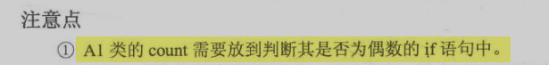

课本上也提到了，也是第二个例题的点要注意。

整个代码我和课本写的几乎一样，虽然是个简单题小小开心一下^^


#### B1018

```c++
#include<cstdio>
#include <map>
using namespace std;
map<char, int> mcia, mcib;
int cmp(char a, char b)
{
	if (a == 'C')
	{
		if (b == 'C') return 0;
		else if (b == 'J') return 1;
		else return -1;
	}
	if (a == 'J')
	{
		if (b == 'C') return -1;
		else if (b == 'J') return 0;
		else return 1;
	}
	if (a == 'B')
	{
		if (b == 'C') return 1;
		else if (b == 'J') return -1;
		else return 0;
	}
	return 0;
}
int main()
{
	int N, ans_a1 = 0, ans_0 = 0, amax = 0, bmax = 0;
    //这里初值定义为amax = -1, bmax = -1 会报错，想了一下可能是出现全平的情况
	char tmpa, tmpb;
	scanf("%d", &N);
	for (int i = 0; i < N; i++)
	{
		getchar();
		scanf("%c %c", &tmpa, &tmpb);
		int res = cmp(tmpa, tmpb);
		if (res == 1)
		{
			ans_a1++;
			mcia[tmpa]++;
			amax = max(amax, mcia[tmpa]);
		}
		else if (res == 0)
		{
			ans_0++;
		}
		else
		{
			mcib[tmpb]++;
			bmax = max(bmax, mcib[tmpb]);
		}
	}
	printf("%d %d %d\n", ans_a1, ans_0, N - ans_a1-ans_0);
	printf("%d %d %d\n", N - ans_a1-ans_0, ans_0, ans_a1);
	if (mcia['B'] == amax) printf("B ");
	else if (mcia['C'] == amax) printf("C ");
	else printf("J ");

	if (mcib['B'] == bmax) printf("B");
	else if (mcib['C'] == bmax) printf("C");
	else printf("J");
	return 0;

}
```

遇到问题不要慌张，发现问题，解决问题，不要一出错就否定自己，要详细自己找问题。

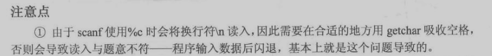

没有错，所以要在`scanf`前用`getchar`吸上一行的`\n`

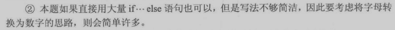

课本的数字转换思路确实比我的简单粗暴的ifelse更简洁，更好


#### A1042

```c++
#include<cstdio>
#include<vector>
#include<string>
#include<iostream>

using namespace std;
vector<string> v1(1), v2(55);
int fx[55], k;
char sarray[5] = { '\0','S','H','C','D' };
void myprint(vector<string>& v)
{
	for (int i = 1; i < 54; i++)
	{
		cout << v[i] << " ";
	}
	cout << v[54];

}
int main()
{
	scanf("%d", &k);

	for (int i = 1; i <= 4; i++)
	{
		char ctmp = sarray[i];
		for (int j = 1; j <= 13; j++)
		{
			string stmp = ctmp + to_string(j);
			v1.push_back(stmp);
		}
	}
	string s1 = "J1", s2 = "J2";
	v1.push_back(s1), v1.push_back(s2);

	for (int i = 1; i <= 54; i++)
	{
		scanf("%d", &fx[i]);
		//if(k>0)
			//v2[fx[i]] = v1[i]; 这里这样写可以少一个循环
	}
	while (k)
	{
		for (int i = 1; i <= 54; i++) 
			v2[fx[i]] = v1[i];
		k--;
		if (k == 0)
		{
			myprint(v2);
			return 0;
		}

		for (int i = 1; i <= 54; i++)
			v1[fx[i]] = v2[i];
		k--;
	}
	myprint(v1);
	return 0;

}
```

一个简单的问题被我搞复杂了，写的不够简洁


==c++ string与int相互转换的方法==

```c++
//1.int->string
int i=13;
string s=to_string(i);

//2.string->int

```

-   [ ] 明天要把这道题用课本的写法在写一遍!
-   [ ] 总结一下该题的英语单词，之后再复习一遍


#### A1046

```bash
highway

```

```c++
#include<cstdio>
#include<algorithm>
#include<vector>
using namespace std;

#define NMAX 1000000
int N, M, s[NMAX], c[NMAX], total, t1, t2,tmp;
vector<int> vans;
int main()
{
	scanf("%d", &N);
	for (int i = 1; i <= N; i++)
	{
		scanf("%d", &s[i]);
		c[i] = c[i - 1] + s[i];
		total += s[i];
	}
	scanf("%d", &M);

	for (int i = 0; i < M; i++)
	{
		scanf("%d%d", &t1, &t2);
		if (t1 > t2)
			swap(t1, t2);
		tmp = c[t2-1] - c[t1-1];
		vans.push_back(min(tmp, total - tmp));
	}
	if(!vans.empty()) printf("%d", vans[0]);

	for (int i = 1; i < vans.size(); i++)
	{
		printf("\n%d",vans[i]);
	}

	return 0;
}
```

前缀和的题目，t1>t2时记得交换

#### A1065

```c++
//这是我第一次写的代码，第三个点过不了，还是取巧了没有解决核心问题
#include<cstdio>
#include <algorithm>
#include <vector>
#define LL long long
using namespace std;

vector<bool> vans;
bool cmp(LL a,LL b,LL c)
{
	return min(a,b)>c-max(a,b);
}
int main()
{
	int T;
	scanf("%d",&T);
	while(T--)
	{
		LL la,lb,lc;
		scanf("%lld%lld%lld",&la,&lb,&lc);
		vans.push_back(cmp(la,lb,lc));
	}
	if(!vans.empty())
		if(vans[0]) printf("Case #1: true");
		else printf("Case #1: false");
	for(int i=1;i<vans.size();i++)
	{
		if(vans[i]) printf("\nCase #%d: true",i+1);
		else printf("\nCase #%d: false",i+1);
	}
	return 0;
}

```

```c++
//这个是参考柳神的代码写的，学到了很多
#include <cstdio>
int main()
{
	long long a,b,c;
	int T;
	scanf("%d",&T);
	for(int i=1;i<=T;i++)
	{
		scanf("%lld%lld%lld",&a,&b,&c);
		long long sum=a+b;
		if(a>0 && b>0 && sum<0)//为什么这里是<0,而下面是>=0
			printf("Case #%d: true",i);
		else if(a<0 && b<0 && sum>=0)
			printf("Case #%d: false",i);
		else if(sum>c) printf("Case #%d: true",i);
		else printf("Case #%d: false",i);
		
		if(i!=T) printf("\n");
	}
	return 0;
}
//虽然pta上能过但是下面这个测试依旧过不了
/*
测试样例
1
9223372036854775808 0 9223372036854775807
*/
```

-   学到
    -   `scanf`输入`long long`用`%lld`
    -   `long long int`最大值是`2^63-1`
    -   `2^63=9223372036854775808`
    -   

上面代码所说的问题有老哥解决了

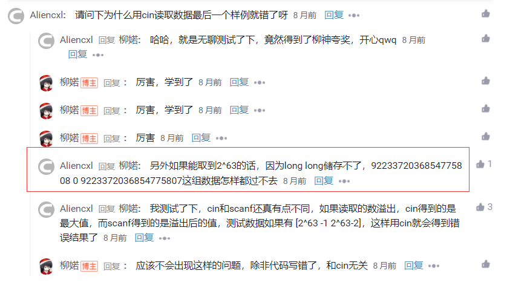


为什么负数溢出可能为0，正数溢出不为0？

课本这里对我上述遇到了所有的问题都进行了解答并且非常清楚

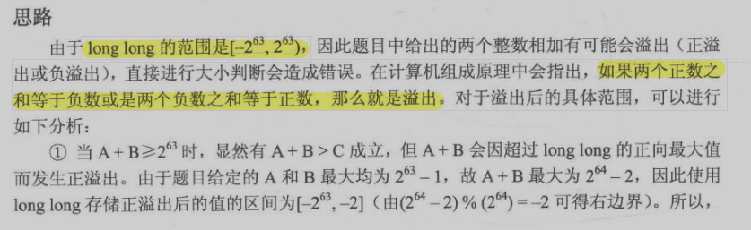

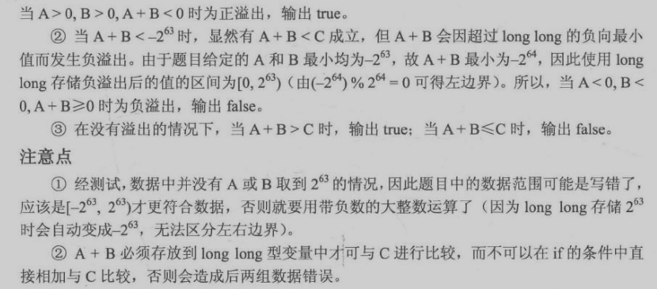


#### B1010

```c++
#include<cstdio>
#include<vector>
using namespace std;
vector<int> fx;
int main()
{
	int t1,t2;
	while(scanf("%d%d",&t1,&t2)!=-1)
	{
		t1*=t2;
		t2--;
		if(t2>=0)
		{
			fx.push_back(t1);
			fx.push_back(t2);
		}
		else break;
	}
	if(!fx.empty())
        printf("%d",fx[0]);
    else 
        printf("0 0");
	for(int i=1;i<fx.size();i++)
	{
		printf(" %d",fx[i]);
	}
	return 0;
}
```

说明了读题的重要性

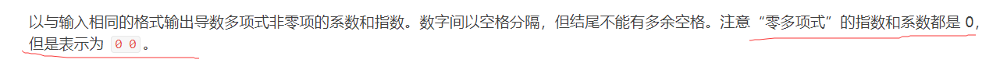

没用的信息怎么可能白给你呢，就这一句话两个点。

==注意==：本题陷阱，当什么都没有输入时，需要输出`0 0`


记住然后以后注意，不二犯。

但我觉得我的方法比课本更好，算法题这个东西就是你看穿`实质`然后做出来，做对就行，不在于将过程还原的多细致

#### A1002

```c++
#include <cstdio>
#include <map>
using namespace std;
map<int,double> m;
int main()
{
	int k,t1;
	double t2;
	for(int i=0;i<2;i++)
	{
		scanf("%d",&k);
		while(k--)
		{
			scanf("%d %lf",&t1,&t2);
			m[t1]+=t2;
			if(i==1 && m[t1]==0)
				m.erase(t1);
		}
	}
	printf("%d", m.size());
	for(map<int,double>::reverse_iterator it=m.rbegin();it!=m.rend();it++)
	{
		printf(" %d %.1lf",it->first,it->second);
	}
	return 0;
	
}
```

这题学到了非常多的东西。

1.double的输入输出

`double`用`scanf`输入，`printf`输出时，都用`%lf`

==这里要总结上所有的输入输出==

2.map的用法

```c++
//定义
map<int,double> m;
//初始化
//增
//删
	//删除键值为1的键值对
	int t1=1;
	m.erase(t1);
//改
//查
//遍历
	//正序遍历
	for(map<int,double>::iterator it=m.begin();it!=m.end();it++)
    {
        printf("%d %lf",it->first,it->second);
    }
	//倒序遍历
	for(map<int,double>::reverse_iterator it=m.rbegin();it!=m.rend();it++)
    {
        printf("%d %lf",it->first,it->second);
    }
```

==总结stl用法==

#### A1009

```c++
#include<cstdio>
#include <map>
using namespace std;
map<int,double> m1,m2,m3; 
int main()
{
	int k,t1;
	double t2;
	scanf("%d",&k);
	while(k--)
	{
		scanf("%d%lf",&t1,&t2);
		m1[t1]=t2;
	}
	scanf("%d",&k);
	while(k--)
	{
		scanf("%d%lf",&t1,&t2);
		m2[t1]=t2;
	}
	for(map<int,double>::iterator it1=m1.begin();it1!=m1.end();it1++)
	{
		for(map<int,double>::iterator it2=m2.begin();it2!=m2.end();it2++)
		{
			m3[it1->first + it2->first]+=it1->second * it2->second;
		}
	}
	for(map<int,double>::iterator it3=m3.begin();it3!=m3.end();it3++)
	{
		if(it3->second==0)
		{
			int tmp=it3->first;
			it3++;
			m3.erase(tmp);
		}
	}
	printf("%d",m3.size() );
	for(map<int,double>::reverse_iterator it3=m3.rbegin();it3!=m3.rend();it3++)
	{
		printf(" %d %.1lf",it3->first,it3->second);
	}
	return 0;
}
```

上个题学会了这个题就是手到擒来，一看一遍就过了，所以学东西要彻底学明白，学一个题目就把那一类题目彻底弄明白，通过题目学思想，学知识点才有意义

### 3.2查找元素

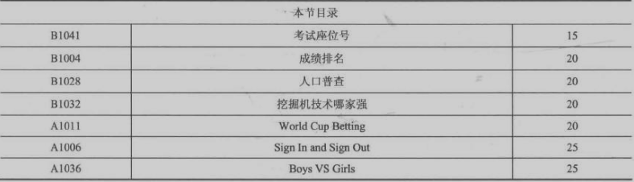

#### B1041

```c++
#include<cstdio>
#include<string>
#include<map>
#include<iostream>
using namespace std;
struct node {
	string idnum;
	int examno;
};
map<int, node> m;
int main()
{
	int n, M;
	scanf("%d", &n);
	for (int i = 0; i < n; i++)
	{
		string s;
		int t1, t2;
		cin >> s;
		scanf("%d%d", &t1, &t2);
		node tn{ s,t2 };
		m[t1] = tn;
	}
	scanf("%d", &M);
	for (int i = 0; i < M; i++)
	{
		int t;
		scanf("%d", &t);
		printf("%s %d\n", m[t].idnum.c_str(), m[t].examno);
	}
	return 0;
}
```

1.对于string的输入的总结

```c++
//对于一段字符串的输入要采用cin,遇到空格/回车停止
string s;
cin>>s;
//

```

不能使用scanf对string类的对象进行输入，[原因](https://blog.csdn.net/oShuaiFeng/article/details/80712211?utm_medium=distribute.pc_relevant.none-task-blog-2%7Edefault%7EBlogCommendFromMachineLearnPai2%7Edefault-1.control&dist_request_id=1329188.24027.16179731657109267&depth_1-utm_source=distribute.pc_relevant.none-task-blog-2%7Edefault%7EBlogCommendFromMachineLearnPai2%7Edefault-1.control)


#### B1004

```c++
#include<cstdio>
#include<algorithm>
#include<string>
#include<iostream>
using namespace std;
int main()
{
	string h1,h2,l1,l2,t1,t2;
	int h3=-1,l3=101,n,t;
	scanf("%d",&n);
	for(int i=0;i<n;i++)
	{
		cin>>t1>>t2;
		scanf("%d",&t);
		if(t>h3)
		{
			h1=t1;
			h2=t2;
			h3=t;
		}
		if(t<l3)
		{
			l1=t1;
			l2=t2;
			l3=t;
		}
	}
	cout<<h1<<" "<<h2<<endl;
	cout<<l1<<" "<<l2;
}
```

这种题可以做快一点

#### B1028

```c++
#include<cstdio>
#include<iostream>
#include<algorithm>
#include<string>
using namespace std;

//1 i1>i2 0 i1=i2 -1 i1<i2
int cmp(int y1,int m1,int d1,int y2,int m2,int d2)
{
	if(y1==y2)
	{
		if(m1==m2)
		{
			if(d1==d2)
				return 0;
			else return d1>d2? 1:-1;
		}
		else return m1>m2? 1:-1;
	}
	else return y1>y2? 1:-1;
}
bool check(int y,int m,int d)
{
	if(cmp(y,m,d,2014,9,6)==1)
	{
		return false;
	}
	if(cmp(y,m,d,1814,9,6)==-1)
		return false;
	return true;
}
int n,ans=0;
int y1=2017,y2,m1,m2,d1,d2,ty,tm,td;
int main()
{

	string s1,s2,ts;
	scanf("%d",&n);
	for(int i=0;i<n;i++)
	{
		cin>>ts;
		scanf("%d/%d/%d",&ty,&tm,&td);
		if(check(ty,tm,td))
		{
			ans++;
			if(cmp(ty,tm,td,y1,m1,d1)==-1)
				y1=ty,m1=tm,d1=td,s1=ts;
			if(cmp(ty,tm,td,y2,m2,d2)==1)
				y2=ty,m2=tm,d2=td,s2=ts;
		}
	}
	printf("%d",ans);
    if(ans!=0)
	    cout<<" "<<s1<<" "<<s2;
	return 0;
}
```

注意特判，==题目保证最年长和最年轻的人没有并列==只能说明当存在最年长和最年轻的人时这两个不是一个人，也有可能一个有效的人都没有这样只输出`0`后面什么都没有空格也不行

#### B1032

```c++
#include<cstdio>
#include<algorithm>
#include<map>
using namespace std;
map<int,int> m;
int main()
{
	int n,ans_num=0,ans_no;
	scanf("%d",&n);
	for(int i=0;i<n;i++)
	{
		int t1,t2;
		scanf("%d%d",&t1,&t2);
		m[t1]+=t2;
		if(m[t1]>ans_num)
			ans_num=m[t1],ans_no=t1;
	}
	printf("%d %d",ans_no,ans_num);
	return 0;
}
```

一道极其简单的题目做成这个样子，原因是因为英语不行理解错题意了，将找出最早到和最晚到问题理解成动态区间问题(当记录下既开门又锁门的人，开门：办公室无人时进去的人，锁门：从办公室出来时办公室无人的人)

这样的话代码如下：

```c++
#include<cstdio>
#include<iostream>
#include<string>
#include<algorithm>
#include<vector>
#include<map>
using namespace std;
map<string,pair<bool,bool>> m;
struct node
{
	int h,m,s;
	string id;
	bool flag,b1=false,b2=false;//0 进 1 出
};
bool cmp(node aa,node bb)
{
	return aa.h*3600+aa.m*60+aa.s<bb.h*3600+bb.m*60+bb.s;
}
vector<node> v;
int main()
{
	int n;
	scanf("%d",&n);
	for(int i=0;i<n;i++)
	{
		node tmp1,tmp2;
		cin>>tmp1.id;
		tmp2.id=tmp1.id;
		scanf("%d:%d:%d",&tmp1.h,&tmp1.m,&tmp1.s);
		scanf("%d:%d:%d",&tmp2.h,&tmp2.m,&tmp2.s);
		tmp1.flag=0,tmp2.flag=1;
		pair<bool,bool> p{false,false};
		m[tmp1.id]=p;
		v.push_back(tmp1),v.push_back(tmp2);
	}
	sort(v.begin(),v.end(),cmp);
	int now=0;
	for(int i=0;i<v.size();i++)
	{
		if(!v[i].flag)
		{
			if(now==0)
			{
				m[v[i].id].first=true;
			}
			now++;
		}
		else
		{
			if(now==1)
			{
				m[v[i].id].second=true;
			}
			now--;
		}
	}
	for(map<string,pair<bool,bool>>::iterator it=m.begin();it!=m.end();it++)
	{
		if(it->second.first && it->second.second)
			cout<<it->first<<" ";
	}
	return 0;

}
```

这个题的重点是

​	1.将时间转化为一个值方便进行比较

​	2.定义自己的inf，`#define inf 0x7fffffff`或`#define MAX (1<<31)-1`

​	int的范围是`-2^31 (-2147483648) ~ 2^31-1 (2147483647)`

#### A1011

```c++
#include<cstdio>
#include<algorithm>
#include<vector>
#include<iostream>
using namespace std;
vector<int> v;
char hc[4]={'\0','W','T','L'};
double w,t,l;
int main()
{
	double res=1;
	for(int i=0;i<3;i++)
	{
		double t1,t2,t3,tmax;
		scanf("%lf%lf%lf",&t1,&t2,&t3);	
		tmax=max(max(t1,t2),t3);
		if(tmax==t1)
			v.push_back(1);
		else if(tmax==t2)
			v.push_back(2);
		else v.push_back(3);
		res*=tmax;
	}
	for(int i=0;i<v.size();i++)
	{
		cout<<hc[v[i]]<<" ";
	}

	double ans=(res*0.65-1)*2;	
	printf("%.2lf",ans);
	return 0;
}

```

#### A1006

```c++
#include<cstdio>
#include<string>
#include<iostream>
using namespace std;
#define MAX 0x3fffffff
int main()
{
	int n,ibegin=MAX,iend=0,t1,t2,t3;
	string ts,sbegin,send;
	scanf("%d",&n);
	for(int i=0;i<n;i++)
	{
		cin>>ts;
		scanf("%d:%d:%d",&t1,&t2,&t3);
		t1=t1*3600+t2*60+t3;
		if(t1<ibegin) ibegin=t1,sbegin=ts;
		scanf("%d:%d:%d",&t1,&t2,&t3);
		t1=t1*3600+t2*60+t3;
		if(t1>iend) iend=t1,send=ts;
	}
	cout<<sbegin<<" "<<send;
	return 0;
}
```
#### A1036

```c++
#include<cstdio>
#include<string>
#include<iostream>
#include<algorithm>
using namespace std;
int n,fc,mc=101,t4;
string f1,f2,m1,m2,t1,t2,t3;
bool bf,bm;

int main()
{
	scanf("%d",&n);
	for(int i=0;i<n;i++)
	{
		cin>>t1>>t2>>t3>>t4;
		if(t2=="M")
		{
			if(t4<mc)
				mc=t4,m1=t1,m2=t3,bm=true;
		}
		else
		{
			if(t4>fc)
				fc=t4,f1=t1,f2=t3,bf=true;
		}
	}
	if(bf)
		cout<<f1<<" "<<f2<<endl;
	else cout<<"Absent"<<endl;
	if(bm)
		cout<<m1<<" "<<m2<<endl;
	else cout<<"Absent"<<endl;
	if(bf && bm)
		cout<<fc-mc;
	else cout<<"NA";
	return 0;
}
```

### 3.3 图像输出

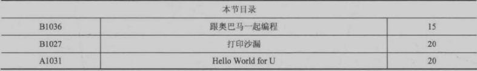

#### B1036

```c++
#include<cstdio>
int main()
{
	int r,c;
	char tar;
	scanf("%d %c",&c,&tar);
	r=((c+1) >> 1)-2;
	for(int i=0;i<c;i++)
	{
		printf("%c",tar);
	}
    printf("\n");
	for(int i=0;i<r;i++)
	{
		printf("%c",tar);
		for(int i=0;i<c-2;i++) printf(" ");
		printf("%c\n",tar);
	}
	for(int i=0;i<c;i++)
	{
		printf("%c",tar);
	}
	return 0;
}
```
注意四舍五入

#### B1027

```c++
#include<cstdio>
int num[1001];
int main()
{
	num[1]=1;
	int m,n,col;
	char tar;
	scanf("%d %c",&m,&tar);
	for(int i=2;i<100;i++)
	{
		num[i]=num[i-1]+(2*i-1)*2;
		if(m>=num[i-1] && m<num[i])
		{
			n=i-1,m-=num[i-1];
			break;
		}
	}
	col=2*n-1;
	for(int i=n,j=0;i>0;i--,j++)
	{
		for(int k=0;k<j;k++)
		{
			printf(" ");
		}
		for(int k=0;k<2*i-1;k++)
		{
			printf("%c", tar);
		}
		printf("\n");
	}
	for(int i=2,j=n-2;i<=n;i++,j--)
	{
		for(int k=0;k<j;k++)
			printf(" ");
		for(int j=0;j<2*i-1;j++) 
			printf("%c", tar);
		printf("\n");
	}
	printf("%d", m);
	return 0;

}
```

从这道题目开始，每道题计时做

#### A1031

```c++
#include<cstdio>
#include<string>
#include<iostream>
using namespace std;
int main()
{
	string s;
	cin>>s;
	int n=s.size(),t,n2;
	if((n-1)%3==0)
		t=(n-1)/3,n2=t+1;
	else if((n-1)%3==1)
		t=(n-2)/3,n2=t+2;
	else t=(n-3)/3,n2=t+3;
	int l=0,r=n-1;
	for(int i=0;i<t;i++)
	{
		printf("%c",s[l++]);
		for(int j=0;j<n2-2;j++)
			printf(" ");
		printf("%c\n",s[r--]);
	}
	while(l<=r)
	{
		printf("%c",s[l++]);
	}
	return 0;
}
```
### 3.4日期处理

### 3.5进制转换 

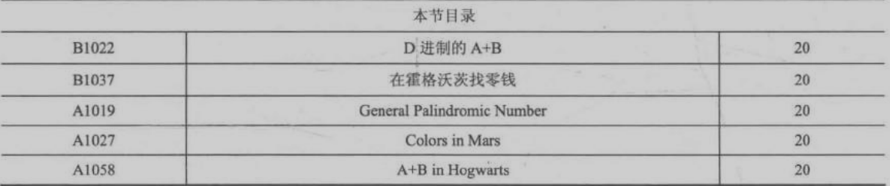

#### B1022

```c++
#include<cstdio>
#include<vector>
using namespace std;
vector<int> v;
int main()
{
	int t1,t2,d;
	scanf("%d%d%d",&t1,&t2,&d);
	t1+=t2;
	while(t1)
	{
		v.push_back(t1%d);
		t1/=d;
	}
	if(v.empty())
		printf("0");
	else
		for(int i=v.size()-1;i>=0;i--)
			printf("%d",v[i]);
	return 0;
}
```
注意0的问题

#### B1037

```c++
#include<cstdio>
int to(int a,int b,int c)
{
	return a*17*29+b*29+c;
}
int main()
{
	int a1,a2,a3,b1,b2,b3;
	scanf("%d.%d.%d %d.%d.%d",&a1,&a2,&a3,&b1,&b2,&b3);
	int ans=to(b1,b2,b3)-to(a1,a2,a3);
	if(ans<0)
	{
		printf("-");
		ans=-ans;
	}
	printf("%d.%d.%d",ans/29/17,ans/29%17,ans%29);
	return 0;
}
```

#### A1019

```c++
#include<cstdio>
#include<vector>
using namespace std;
vector<int> v;
bool check()
{
	for(int l=0,r=v.size()-1;l<r;l++,r--)
	{
		if(v[l]!=v[r])
			return false;
	}
	return true;
}
int main()
{
	int n,d;
	scanf("%d%d",&n,&d);
	while(n)
	{
		v.push_back(n%d);
		n/=d;
	}
	if(v.empty())
		v.push_back(0);
	if(check())
		printf("Yes\n");
	else 
		printf("No\n");
	printf("%d",v[v.size()-1]);
	for(int i=v.size()-2;i>=0;i--)
	{
		printf(" %d",v[i]);
	}
	
	return 0;

}
```

#### A1027

```c++
#include<cstdio>
#include<string>
#include<iostream>
#include<vector>
using namespace std;
vector<string> vs{"0","1","2","3","4","5","6","7","8","9","A","B","C"};
void myprint(int x)
{
	string res="";
	while(x)
	{
		res=vs[x%13]+res;
		x/=13;
	}
	if(res.size()==0)
		res="0";
	if(res.size()==1)
	{
		cout<<"0"<<res;
	}
	else cout<<res;
}
int main()
{
	int a,b,c;
	scanf("%d%d%d",&a,&b,&c);
	printf("#");
	myprint(a);
	myprint(b);
	myprint(c);
	return 0;
}
```
再好好总结以下并记住stl的使用，用着总感觉不安心

#### A1058
错误答案：
```c++
#include<cstdio>
int to(int a,int b,int c)
{
	return a*17*29+b*29+c;
}
int main()
{
	int a1,a2,a3,b1,b2,b3;
	scanf("%d.%d.%d %d.%d.%d",&a1,&a2,&a3,&b1,&b2,&b3);
	int ans=to(b1,b2,b3)+to(a1,a2,a3);
	printf("%d.%d.%d",ans/29/17,ans/29%17,ans%29);
	return 0;
}
```
正确答案：
```c++
#include<cstdio>
long long to(int a,int b,int c)
{
	return (long long)a*17*29+b*29+c;
}
int main()
{
	int a1,a2,a3,b1,b2,b3;
	scanf("%d.%d.%d %d.%d.%d",&a1,&a2,&a3,&b1,&b2,&b3);
	long long  ans=to(b1,b2,b3)+to(a1,a2,a3);
	printf("%d.%d.%d",ans/29/17,ans/29%17,ans%29);
	return 0;
}
```
注意，中间运算过程中可能出现中间数过大而`int溢出`以后写代码和排查错误时要注意这个问题

### 3.6字符串处理

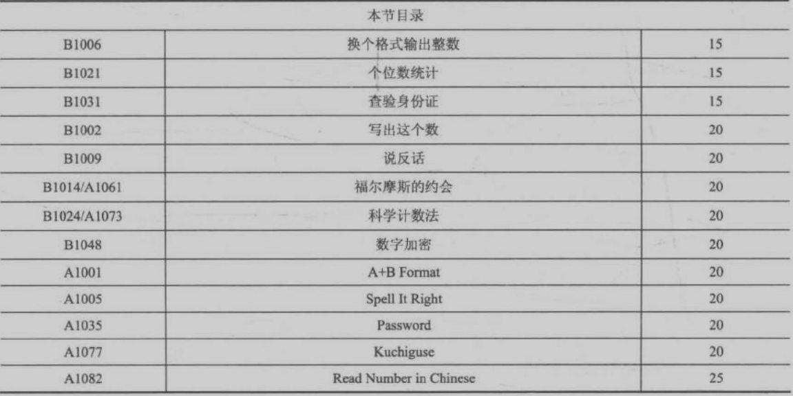

#### B1006

```c++
#include<cstdio>
int main()
{
	int n;
	scanf("%d",&n);
	int g=n%10,s=n/10%10,b=n/100;
	for(int i=0;i<b;i++)
		printf("B");
	for(int i=0;i<s;i++)
		printf("S");
	for(int i=0;i<g;i++)
		printf("%d",i+1);
	return 0;
}
```
这道题更是说明了做题就把题作对就行，他规定n<1000就别再考虑10000的事了把题目简洁明了的作对就够了

#### B1021

```c++
#include<cstdio>
#include<string>
#include<iostream>
using namespace std;
int num[11];
int n;
int main()
{
	string s;
	cin>>s;
	for(int i=0;i<s.size();i++)
		num[s[i]-'0']++;
	for(int i=0;i<10;i++)
	{
		if(num[i])
			printf("%d:%d\n",i,num[i]);
	}
	return 0;
}
```

#### B1031

```c++
#include<cstdio>
#include<string>
#include<iostream>
#include<algorithm>
#include<vector>
using namespace std;
int iz[17]={7,9,10,5,8,4,2,1,6,3,7,9,10,5,8,4,2};
char im[11]={'1','0', 'X', '9', '8', '7', '6', '5', '4', '3', '2'};
vector<string> ans;
int main()
{
	int n;
	scanf("%d",&n);
	for(int i=0;i<n;i++)
	{
		string s;
		cin>>s;
		int sum=0;
		for(int i=0;i<17;i++)
		{
			sum+=(s[i]-'0')*iz[i];
		}
		if(im[sum%11]!=s[17])
			ans.push_back(s);
	}
	if(ans.empty())
		printf("All passed");
	else
		for(int i=0;i<ans.size();i++)
			printf("%s\n",ans[i].c_str() );
	return 0;
}
```

#### B1002

```c++
#include<cstdio>
#include<string>
#include<iostream>
#include<vector>
using namespace std;
vector<string> v{"ling","yi","er","san","si","wu","liu","qi","ba","jiu"};
int main()
{
	string s;
	cin>>s;
	int sum=0;
	for(int i=0;i<s.size();i++)
		sum+=s[i]-'0';
	s=to_string(sum);
	cout<<v[s[0]-'0'];
	for(int i=1;i<s.size();i++)
	{
		cout<<" "<<v[s[i]-'0'];
	}
	return 0;
}
```

#### B1009

```c++
#include<cstdio>
#include<string>
#include<iostream>
#include<vector>
using namespace std;
vector<string> v;
int main()
{
	char c;
	string s;
	while(scanf("%c",&c)!=EOF && c!='\n')
	{
		if(c==' ')
		{
			v.push_back(s);
			s="";
		}
		else
			s+=c;
	}
	v.push_back(s);
	if(!v.empty())
		cout<<v[v.size()-1];
	for(int i=v.size()-2;i>=0;i--)
		cout<<" "<<v[i];
	return 0;
}
```


#### B1014/A1061
错误：
```c++
#include<cstdio>
#include<string>
#include<iostream>
#include<vector>
3485djDkxh4hhGE 
2984akDfkkkkggEdsb
using namespace std;
int main()
{
	string s1,s2,s3,s4;
	cin>>s1>>s2>>s3>>s4;
	int ans1=0,ans2,ans3;
	for(int i=0;i<min(s1.size(),s2.size());i++)
	{
		
		if(ans1!=0 && s1[i]==s2[i])
		{
			if(s1[i]>='0' && s1[i]<='9')
				ans2=s1[i]-'0';
			else if(s1[i]>='A' && s1[i]<='N')
				ans2=s1[i]-'A'+10;
			break;
		}
		if(ans1==0 && s1[i]==s2[i] && s1[i]>='A' && s1[i]<='Z')
			ans1=s1[i]-'A'+1;
	}
	for(int i=0;i<min(s3.size(),s4.size());i++)
		if(s3[i]==s4[i])
		{
			ans3=i;
			break;
		}
	vector<string> v{"MON","TUE","WED","THU","FRI","SAT","SUN"};
	cout<<v[ans1-1];
	printf(" %0d:%0d",ans2,ans3);
	return 0;
}

```
正确：
```c++
#include<cstdio>
#include<string>
#include<iostream>
#include<vector>
#include<algorithm>
using namespace std;
int main()
{
	string s1, s2, s3, s4;
	cin >> s1 >> s2 >> s3 >> s4;
	int ans1 = 0, ans2=0, ans3=0;
	for (int i = 0; i < min(s1.size(), s2.size()); i++)
	{
		if (ans1 != 0 && s1[i] == s2[i])
		{
			if (s1[i] >= '0' && s1[i] <= '9')
				ans2 = s1[i] - '0';
			else if (s1[i] >= 'A' && s1[i] <= 'N')
				ans2 = s1[i] - 'A' + 10;
			if(ans2!=0)
            break;
		}
		if (ans1 == 0 && s1[i] == s2[i] && s1[i] >= 'A' && s1[i] <= 'G')
			ans1 = s1[i] - 'A' + 1;
		
	}
	for (int i = 0; i < min(s3.size(), s4.size()); i++)
		if (s3[i] == s4[i] && ((s3[i]>='A' && s3[i]<='Z')||(s3[i] >= 'a' && s3[i] <= 'z')))
		{
			ans3 = i;
			break;
		}
	vector<string> v{ "MON","TUE","WED","THU","FRI","SAT","SUN" };
	cout << v[ans1 - 1];
	printf(" %02d:%02d", ans2, ans3);
	return 0;
}
```
卡了两个点，这题告诉我们要认真读题，理解题意，弄明白题目想要达成什么目的，搞清楚题目的隐含条件


可以再看看这道题的测试点分析总结总结，这要是英文题目怕是你很难作对

#### B1024/A1073

```c++
#include<cstdio>
#include<string>
#include<iostream>
#include<algorithm>
using namespace std;
int main()
{
	string s, ans = "";
	int p = 0, flag = 0, loc, change = 0, l = 0, r;
	cin >> s;
	if (s[p++] == '-')
		flag = 1;
	while (s[p] != '.')
		ans += s[p++];
	loc =p++ -1;
	while (s[p] != 'E')
		ans += s[p++];
	r = p - 2;
	change = atoi(s.substr(p + 1).c_str());
	if (change < 0)
	{
		loc += change;
		if (loc > l)
			ans=ans.substr(0, loc)+"."+ans.substr(loc);
		else
		{
			for (int i = 0; i < abs(loc); i++)
				ans = "0" + ans;
			ans = "0." + ans;
		}

	}
	else
	{
		loc += change;
		if (loc>= r)
		{
			for (int i = 0; i < loc - r; i++)
				ans = ans + "0";
		}
		else ans = ans.substr(0, loc) + "." + ans.substr(loc);
	}
	if (flag)
		cout << "-";
	cout << ans;
	return 0;

}

```

虽然一遍就通过了但是写了非常长时间，并且代码写的乱七八糟的，要好好学习别人的思想，还差的远着呢

#### B1048

```c++
#include<cstdio>
#include<string>
#include<iostream>
#include<algorithm>
#include<vector>
using namespace std;
vector<int> v;
vector<char> vs{ 'J','Q','K' };
//  12345
//36878297
int main()
{
	string s1, s2;
	int flag = 1;
	cin >> s1 >> s2;
	int p1 = s1.size() - 1, p2 = s2.size() - 1;
	while (p1>=0 && p2>=0)
	{
		int t1 = s1[p1] - '0', t2 = s2[p2] - '0';
		if (flag == 1)
		{
			v.push_back((t1 + t2) % 13);
		}
		else
		{
			if (t2 - t1 < 0)
				v.push_back(t2 - t1 + 10);
			else
				v.push_back(t2 - t1);
		}
		flag = -flag, --p1, --p2;
	}
	while (p1>=0)
	{
		int t1 = s1[p1] - '0', t2 = 0;
		if (flag == 1)
		{
			v.push_back((t1 + t2) % 13);
		}
		else
		{
			if (t2 - t1 < 0)
				v.push_back(t2 - t1 + 10);
			else
				v.push_back(t2 - t1);
		}
		flag = -flag, --p1;
	}
	while (p2>=0)
	{
		int t1 = 0, t2 = s2[p2] - '0';
		if (flag == 1)
		{
			v.push_back((t1 + t2) % 13);
		}
		else
		{
			if (t2 - t1 < 0)
				v.push_back(t2 - t1 + 10);
			else
				v.push_back(t2 - t1);
		}
		flag = -flag, --p2;
	}
	for (int i = v.size() - 1; i >= 0; i--)
	{
		if (v[i] < 10)
			printf("%d", v[i]);
		else
			printf("%c", (vs[v[i] - 10]));
	}
	return 0;
}
```

细节处做好别调试调一天，学学别人简练的写法

#### A1001

```c++
#include<cstdio>
#include<string>
#include<iostream>
using namespace std;

int main()
{
	int a,b;
	scanf("%d%d",&a,&b);
	a+=b;
	string s=to_string(a),ans="";
	for(int i=s.size()-1,k=0;i>=0;i--)
	{
		ans=s[i]+ans;
		if(k==2 && s[i]>='0' && s[i]<='9' && i>0 && s[i-1]>='0' && s[i-1]<='9')
		{
			ans=','+ans;
			k=0;
		}
		else k++;
	}
	cout<<ans;
	return 0;
}
```


#### A1005

```c++
#include<cstdio>
#include<string>
#include<iostream>
#include<vector>
using namespace std;
vector<string> v{"zero","one","two","three","four","five","six","seven","eight","nine"};
int main()
{
	int n,sum=0;
	string s;
	cin>>s;
	for(int i=0;i<s.size();i++)
	{
		sum+=s[i]-'0';
	}
	s=to_string(sum);
	cout<<v[s[0]-'0'];
	for(int i=1;i<s.size();i++)
	{
		cout<<" "<<v[s[i]-'0'];
	}
	return 0;
}
```


#### A1035

```c++
#include<cstdio>
#include<string>
#include<iostream>
#include<algorithm>
#include<vector>
using namespace std;
vector<pair<string,string>> v;
int main()
{
	int n;
	scanf("%d",&n);
	for(int i=0;i<n;i++)
	{
		string s1,s2,s3="";
		cin>>s1>>s2;
		for(int i=0;i<s2.size();i++)
		{
			if(s2[i]=='1')
				s3+='@';
			else if(s2[i]=='0')
				s3+='%';
			else if(s2[i]=='l')
				s3+='L';
			else if(s2[i]=='O')
				s3+='o';
			else s3+=s2[i];
		}
		if(s2!=s3)
		{
			pair<string,string> tmp{s1,s3};
			v.push_back(tmp);
		}
	}
	if(v.empty())
	{
		if(n==1)
			printf("There is %d account and no account is modified",n);
		else
			printf("There are %d accounts and no account is modified",n);
	}
	else 
	{
		cout<<v.size()<<endl;
		for(int i=0;i<v.size();i++)
			cout<<v[i].first<<" "<<v[i].second<<endl;
	}
	return 0;
}
```

#### A1077

```bash
#单词部分
notorious
particles
exaggerated
```

```c++
#include<cstdio>
#include<string>
#include<iostream>
#include<vector>
using namespace std;
int main()
{
	int n;
	scanf("%d",&n);
	string ans="@";
	getchar();
	for(int i=0;i<n;i++)
	{
		string s;
		getline(cin,s);
		if(ans=="@")
			ans=s;
		else
		{
			int p1=s.size()-1,p2=ans.size()-1;
			for(;p1>=0 && p2>=0;p1--,p2--)
				if(s[p1]!=ans[p2])
					break;
			ans=ans.substr(p2+1);
		}
	}
	if(ans.empty())
		cout<<"nai";
	else
		cout<<ans;
	return 0;
}

```

1.读入一行string:`string s;getline(cin,s);`

2.`getchar();`吸回车，这个要彻底弄透

3.如何保证初始化的问题，即ans初值赋`""`会出错有没有更好的解决办法

#### A1082**没过**

```c++
#include<cstdio>
#include<string>
#include<iostream>
#include<vector>
using namespace std;
vector<string> vs{ "ling","yi","er","san","si","wu","liu","qi","ba","jiu" };
vector<string> dw{"", "","Shi","Bai","Qian","Wan","Yi" };
string solu(string& tar, string& ans)
{
	if (tar.size() == 1)
		if (ans.empty())
			return vs[tar[0] - '0'];
		else
			return ans + vs[tar[0] - '0'];
	if (tar.size() < 5)
	{
		ans+= vs[tar[0] - '0']+" " + dw[tar.size()]+" ";
		tar = tar.substr(1);
		return solu(tar, ans);
	}
	if (tar.size() < 9)
	{
		string t1= tar.substr(0, tar.size() - 4),t2="";
		ans+=solu(t1,t2) + " " + "Wan ";
		tar = tar.substr(tar.size() - 4);
		return solu(tar, ans);
	}
	if (tar.size() == 9)
	{
		ans += vs[tar[0] - '0']  + " Yi ";
		tar = tar.substr(1);
		return solu(tar, ans);
	}
}
int main()
{
	int n, flag = 0;
	scanf("%d", &n);
	 if(n<0)
	 	flag=1,n=-n;
	 if (flag)
		 cout << "Fu ";
	 string tar = to_string(n), s = "";
	 cout << solu(tar, s);
	 return 0;

}
```

处理不了零

-   连续零只输出一个
-   最后零不输出(输入0特判)


